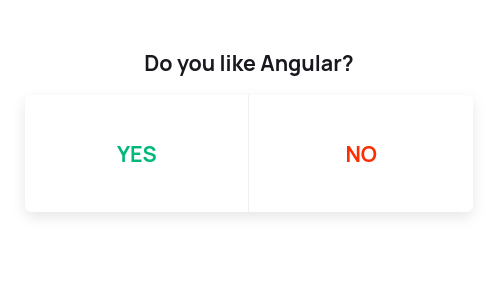
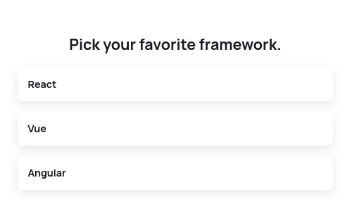

<!-- # react-leaf-polls -->

# 

<b>react-leaf-polls</b> is a set of multiple reusable and customizable poll types.

[](https://standardjs.com)

[](https://github.com/salalo/react-leaf-polls/blob/master/LICENSE)

#  

## Install

### NPM

```bash
npm i --save react-leaf-polls
```

### Yarn

```bash
yarn add react-leaf-polls
```

## Usage

```ts
import { LeafPoll, Result } from 'react-leaf-polls'
import 'react-leaf-polls/dist/index.css'

// Persistent data array (typically fetched from the server)
const resData = [
  { id: 0, text: 'Answer 1', votes: 0 },
  { id: 1, text: 'Answer 2', votes: 0 },
  { id: 2, text: 'Answer 3', votes: 0 }
]

// Object keys may vary on the poll type (see the 'Theme options' table below)
const customTheme = {
  textColor: 'black',
  mainColor: '#00B87B',
  backgroundColor: 'rgb(255,255,255)',
  alignment: 'center'
}

function vote(item: Result, results: Result[]) {
  // Here you probably want to manage
  // and return the modified data to the server.
}

const App = () => {
  return (
    <LeafPoll
      type='multiple'
      question='What you wanna ask?'
      results={resData}
      theme={customTheme}
      onVote={vote}
      isVoted={false}
    />
  )
}
```

## Component Props

| Prop     |                  Type/Options                  | Required |         Default         | Description                                                                                                                                                                                                                                                    |
| -------- | :--------------------------------------------: | :------: | :---------------------: | -------------------------------------------------------------------------------------------------------------------------------------------------------------------------------------------------------------------------------------------------------------- |
| type     |             "multiple" or "binary"             |    ✔     |         binary          | Determines rendered poll type. Binary is recommended for yes-no questions where multiple is "one from many".                                                                                                                                                   |
| question |                     String                     |    ✖     |                         | Question visible on top of the poll. Invisible if not set.                                                                                                                                                                                                     |
| results  | Array of objects with keys "text" and "votes". |    ✔     |                         | Results data is visible to the user after the vote. <br> Should be stored permanently! Usually red and wrote to the persistent storage source. <br> Array is modified every time user votes by incrementing the "votes" value and adding "percentage" element. |
| theme    |       Object <br>More in the table below       |    ✖     | More in the table below | Theme allows you to customize the look and feel of given poll. Depending on poll type there are different options.                                                                                                                                             |
| isVoted  |                    Boolean                     |    ✖     |          false          | When set to true, poll will show the results by default on mount and user won't be able to vote. Might be helpful when we want to keep showing results on every rerender after user has voted.                                                                 |
| *isVotedId  |                    Number                     |    ✖     |                       | When an id is set, poll will indicate with the main theme color the result which the user has already voted on. To be used in conjunction with isVoted. ***Only enabled for multiple**.     |
| onVote   |                    Function                    |    ✖     |                         | Callback function running when user picks the answer. Returns the clicked item's and whole results modified object as arguments.                                                                                                                               |

### Theme options

Theme is an object where no value is mandatory. Colors can get any type of color notations.

| Option          | Default | Poll type | Description                                                                                |
| --------------- | :-----: | :-------: | ------------------------------------------------------------------------------------------ |
| mainColor       | #00B87B | multiple  | Marks the picked answer after the vote.                                                    |
| textColor       | #19181f |   both    | Color of question's and answer's text.                                                     |
| leftColor       |         |  binary   | Color of left cell's text in the binary poll.                                              |
| rightColor      |         |  binary   | Color of right cell's text in the binary poll.                                             |
| backgroundColor | #ffffff |   both    | Background of answer's pane.                                                               |
| alignment       | center  |   both    | Changes container's align-items property. <br> "start", "center" or "end" is only allowed. |

## License

MIT © [salalo](https://github.com/salalo)
